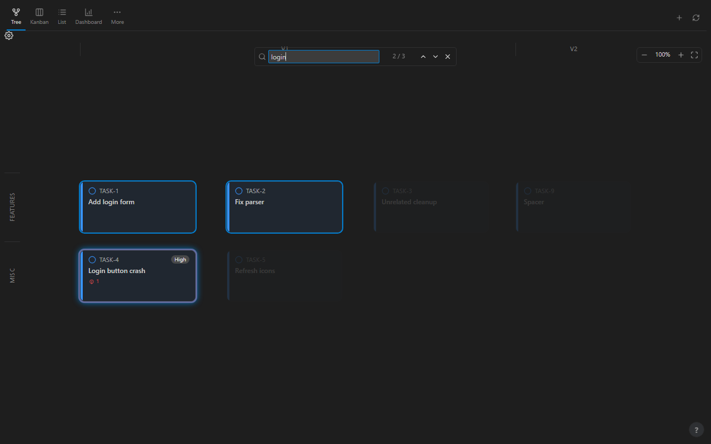
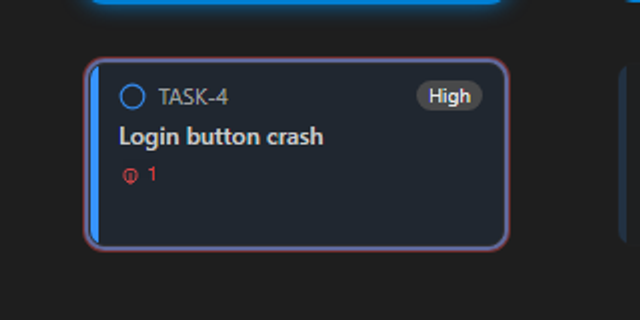
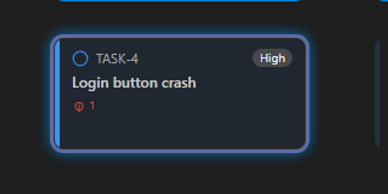
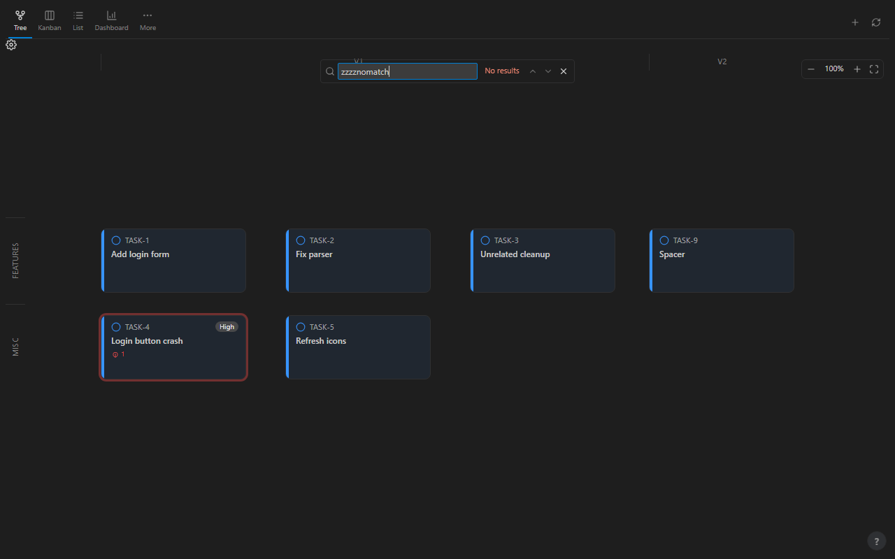
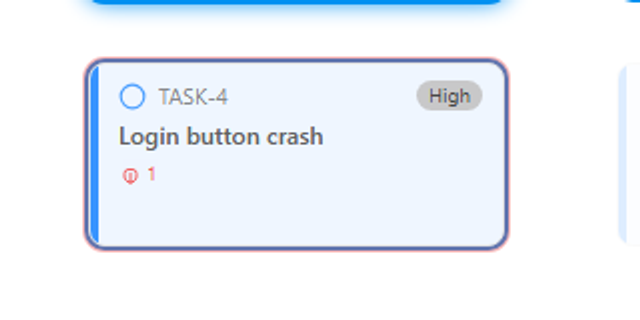
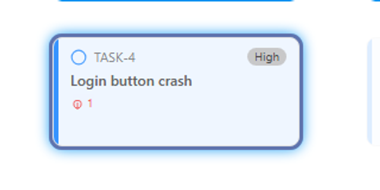

# Visual proof: Tree find bar

*2026-07-12T15:10:23Z by Showboat 0.6.1*
<!-- showboat-id: 6b78f491-dc26-4183-8ba4-75a9c7af74b8 -->

The Tree tab now has an in-canvas find bar: `/` or Ctrl/Cmd-F opens it, it matches on task id + title + description, rings the matches, dims the non-matches, and Enter/Shift-Enter cycles matches in spatial (band, then lane) order, re-centering the viewport on each. Escape closes it. It is a **find, not a filter** — the navigator sidebar's dim-filter is separate and composes with it.

This doc is the last human-eye check that the ring/dim treatment is actually legible — the e2e suite (`e2e/tree-find.spec.ts`) proves the CSS classes get applied, not that the result reads well on screen.

```bash
ls -la dist/webview/styles.css && git log -1 --oneline
```

```output
-rw-r--r-- 1 zedon 197609 72300 Jul 12 22:53 dist/webview/styles.css
b6c5a8b Fix focus-stealing in the tree find-bar mount effect (review finding)
```

`dist/webview/styles.css` is present (the fixture-collapse trap this project already lost an hour to), and the branch is at `b6c5a8b` (Tasks 1-7, reviewed and clean).

**Fixture board** (6 tasks, rendered on the Tree tab via the same postMessage shapes `e2e/tree-find.spec.ts` uses): TASK-1 "Add login form" and TASK-2 "Fix parser" (description "the login parser") both match the query `login`; TASK-4 "Login button crash" also matches on title **and** carries an active bug (`activeBugIds`), so it independently exercises the pre-existing `has-active-bug` ring — a deliberate probe for the known ring-overlap concern. TASK-3, TASK-5, and TASK-9 do not match and should read as dimmed. Captured with a hand-rolled raw-CDP script (Playwright's own browser launch/connect hangs in this sandbox — its driver-subprocess IPC breaks the same way VS Code's `--remote-debugging-pipe` does per `docs/cdp-testing-notes.md`), reusing this repo's own `src/test/cdp/lib/CdpClient.ts` + `cdp-helpers.ts` for the actual CDP calls (Page.navigate, Runtime.evaluate for postMessage injection, Input.dispatchKeyEvent for `/`/typing/Enter/Escape, Page.captureScreenshot).

## Dark theme (vscode-theme-dark-plus)

```bash {image}
docs/images/dark/tree-find-multi-hit.png
```


Query `login` open, 1 / 3. TASK-1 (title match) is the current target — a bright, glowing blue ring, clearly heavier than TASK-2's plain thin blue match ring. TASK-3, TASK-5, and TASK-9 (non-matches) are dimmed to near-invisibility. TASK-4 shows a visibly distinct pink/magenta ring — the bug ring (red) and the match ring (blue) blending, still readable as "different from a plain match" at this state.

```bash {image}
docs/images/dark/tree-find-current-vs-match.png
```



After Enter, 2 / 3 — the current ring moved from TASK-1 to TASK-4, exactly the spatial (band, then lane) order the plan specifies. TASK-1 and TASK-2 both correctly demote to the plain thin match ring. The current-vs-plain-match distinction itself remains clear and legible for TASK-1/TASK-2 throughout.

### Defect check: the has-active-bug + find-current ring overlap

Cropped, 2x-scaled views of TASK-4's ring in the two states above — this is the known cosmetic issue flagged in the brief (`TreeNode.svelte`'s `.has-active-bug.find-current` rule stacks a 3px bug ring and a 3px focus ring at the identical offset/spread).

```bash {image}
docs/images/dark/tree-find-bug-ring-match-crop.png
```



TASK-4 as a plain match (not current): the bug ring and match ring are both 40%-opacity-ish and clearly distinguishable as a blended pink/rose tone — readable as "this card is unusual" even if you can't immediately parse it as "bug + match".

```bash {image}
docs/images/dark/tree-find-bug-ring-current-crop.png
```



TASK-4 as the CURRENT match: the ring reads as **almost pure blue** — the red bug signal is essentially gone, alpha-blended away by the stronger, brighter find-current glow (`0 0 12px 2px` blur layered on top). Side-by-side with the plain-match crop above, this confirms the defect: a bug node loses its bug ring the moment it becomes the current find target. **This is a real, visible legibility defect**, not a hypothetical — see the verdict at the end of this doc.

```bash {image}
docs/images/dark/tree-find-zero-results.png
```



Query `zzzznomatch`: the counter reads "No results" in the error color, and — critically — **nothing is dimmed**. Every card (including TASK-4's permanent bug ring, unrelated to find) looks exactly as it does with the find bar closed. Confirms zero-result does not fall back to "dim everything."

## Light theme (vscode-theme-light-plus)

The rings lean on `var(--vscode-focusBorder)`, which is a light saturated blue on dark and a darker saturated blue on light — worth checking it doesn't wash out against a white canvas.

```bash {image}
docs/images/light/tree-find-multi-hit.png
```


Same `login` query, 1 / 3, on light. The current-ring glow (TASK-1) and plain match ring (TASK-2) both stay legible against the white card background. TASK-3/5/9 dim to a pale gray-blue wash — visibly lighter than the un-dimmed cards, but the contrast margin is much narrower here than on dark (see verdict).

```bash {image}
docs/images/light/tree-find-current-vs-match.png
```


2 / 3 after Enter — current ring correctly moved to TASK-4, same spatial order as dark. TASK-1/TASK-2 demote to plain match rings cleanly.

### Defect check (light theme)

Same TASK-4 crop pair as dark, to confirm the ring-overlap defect is not a dark-theme-only artifact.

```bash {image}
docs/images/light/tree-find-bug-ring-match-crop.png
```



Plain match + bug: a visible purple/violet blend, distinguishable from a plain blue match ring.

```bash {image}
docs/images/light/tree-find-bug-ring-current-crop.png
```



Current match + bug: same defect as dark — the ring reads as solid blue, the red bug signal essentially lost. Confirms the defect is theme-independent (it's a CSS layering order issue, not a color-contrast issue).

```bash {image}
docs/images/light/tree-find-zero-results.png
```


`zzzznomatch` on light: "No results," nothing dimmed. Same clean behavior as dark.

## Verdict

**Legible in both themes:** yes. The multi-hit ring/dim treatment, the current-vs-plain-match distinction, and the zero-result state all read clearly on both dark and light — the accent-ring approach holds up against both a near-black and a near-white canvas, and the dim opacity (0.16) reliably reads as "not a match" without the non-matches becoming illegible (still readable on hover/inspection, just visually deprioritized).

**Current-match ring vs plain match ring:** clearly distinguishable — the current ring is thicker (3px vs 2px) and carries an added 12px blur glow the plain match ring lacks. This holds in both themes and was the easiest of the three claims to verify.

**Defect confirmed, as flagged in the brief:** `TreeNode.svelte`'s `.tree-node.has-active-bug.find-current` rule stacks the 3px bug ring and the 3px find-current ring at the identical box-shadow offset/spread (plus an added 12px blur glow), and empirically the composite reads as **almost pure focus-border blue** — the red bug tint that IS clearly visible on the same node's plain-match state (crops above) is essentially washed out once the current-match glow is layered on. In practice the red bug signal all but disappears the moment that node becomes the current find target, in both dark and light. It is NOT a dealbreaker for this feature (a bug node is still unambiguously `.find-match`/`.find-current`-styled — you can find it — it just silently sheds its "this node has an active bug" cue while it's the cycle target), but it is a real, screenshotted legibility regression for that one narrow intersection, not a hypothetical. Recommend a follow-up: give `.has-active-bug.find-current` a distinct combined treatment (e.g. offset rings at different spreads, like the `.has-active-bug.find-match` rule already does with 3px+2px) instead of two same-spread shadows.

No other legibility issues observed. Not fixed here per instructions — reported with screenshots as evidence for a follow-up task.
